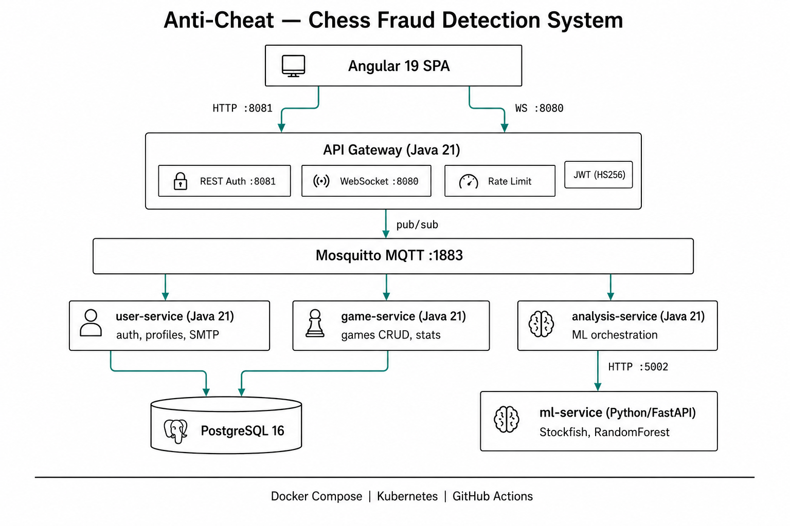

# Anti-Cheat — Chess Fraud Detection System

> Plataforma de detección de trampas en ajedrez online mediante microservicios, event-streaming MQTT y machine learning.

[](https://openjdk.org/)
[](https://angular.dev/)
[](https://python.org/)
[](https://fastapi.tiangolo.com/)
[](anticheat-backend/docker-compose.yml)
[](anticheat-backend/anticheat-backend-infra/k8s/)
[](anticheat-backend/.github/workflows/ci.yml)

---

## Índice

- [Descripción](#descripción)
- [Arquitectura](#arquitectura)
- [Stack Tecnológico](#stack-tecnológico)
- [Justificación del Stack](#justificación-del-stack)
- [Estructura del Proyecto](#estructura-del-proyecto)
- [Inicio Rápido — Docker Compose](#inicio-rápido--docker-compose)
- [Despliegue en Kubernetes](#despliegue-en-kubernetes)
- [Protocolo de Comunicación](#protocolo-de-comunicación)
- [Frontend (Angular 19)](#frontend-angular-19)
- [Backend (Java 21 + Python 3.11)](#backend-java-21--python-311)
- [CI/CD](#cicd)
- [Variables de Entorno](#variables-de-entorno)
- [Seguridad](#seguridad)
- [Desarrollos Futuros](#desarrollos-futuros)

---

## Descripción

Las plataformas de ajedrez online enfrentan un problema creciente: **trampas asistidas por motor**. Los jugadores usan motores de ajedrez (como Stockfish) durante las partidas para obtener una ventaja injusta.

Este sistema construye un **pipeline de detección de fraude** end-to-end que:

1. **Evalúa** cada movimiento contra el juego óptimo del motor usando Stockfish (profundidad 12)
2. **Extrae** 23 características estadísticas de las evaluaciones (varianza, curtosis, entropía espectral, inversiones de ventaja, etc.)
3. **Clasifica** partidas usando un modelo ML entrenado (scikit-learn RandomForest)

| Métrica | Mejora sobre baseline |
|---------|----------------------|
| **Accuracy** | **+9.34%** |
| **Precision** | **+7.42%** |

---

## Arquitectura

<p align="center">
  
</p>

### Flujo de datos

| Flujo | Camino |
|-------|--------|
| **Login / Register** | Cliente → REST `POST /auth/login` → Gateway → MQTT `user/info` → User Service → PostgreSQL → JWT |
| **Conexión WS** | Cliente → `ws://host:8080/ws?token=JWT` → Gateway valida JWT + rate-limit |
| **Analizar partida** | WS `ANALYZE_GAME` → Gateway → MQTT `game/analyze` → Analysis Service → HTTP `POST /eval` → ML Service (Stockfish + RandomForest) → resultado |
| **Guardar partida** | WS `SAVE_GAME` → Gateway → MQTT `game/info` → Game Service → INSERT en `games` + UPDATE contadores en `users` |
| **Consultar perfil** | WS `USER_INFO_REQUEST` → Gateway → MQTT `user/info` → User Service → SELECT `users` |
| **Listar partidas** | WS `GAMES_REQUEST` → Gateway → MQTT `game/info` → Game Service → SELECT `games` |

---

## Stack Tecnológico

| Capa | Tecnología | Propósito |
|------|-----------|-----------|
| **Frontend** | Angular 19, TypeScript, Chart.js, chess.js | SPA responsive con design system propio |
| **Gateway** | Java 21, Tyrus WebSocket, JDK HttpServer | Punto de entrada WS + REST, rate limiter |
| **Microservicios** | Java 21, Maven, JDBC, BCrypt, Jackson | Lógica de negocio (user, game, analysis) |
| **ML** | Python 3.11, FastAPI, scikit-learn, python-chess, Stockfish | Pipeline de detección de fraude |
| **Mensajería** | Eclipse Mosquitto (MQTT 3.1.1) | Event bus asíncrono entre servicios |
| **Base de datos** | PostgreSQL 16 Alpine | Persistencia de usuarios y partidas |
| **Auth** | JWT HMAC-SHA256 (24h TTL) | Autenticación stateless |
| **Infra** | Docker Compose · Kubernetes · GitHub Actions | Orquestación y CI/CD |

---

## Justificación del Stack

### ¿Por qué Java 21 para los microservicios?

Java es el lenguaje con el que tengo mayor dominio y productividad, lo que me permitió centrarme en la arquitectura y la lógica de negocio en vez de pelear con el lenguaje. Más allá de la familiaridad, Java 21 aporta ventajas técnicas concretas para este tipo de sistema:

- **Tipado fuerte y sistema de tipos robusto**: En un protocolo con múltiples tipos de mensaje (`ChessMessage`, `PayloadRegistry`), el tipado estático detecta errores de serialización/deserialización en compilación, no en runtime.
- **Ecosistema maduro para servicios de larga vida**: JDBC nativo, BCrypt, Jackson, Maven — sin necesidad de frameworks pesados como Spring. Los servicios arrancan en ~2 segundos.
- **Concurrencia nativa**: `ExecutorService`, `ConcurrentHashMap` y los clientes MQTT de Eclipse Paho manejan bien la concurrencia multi-usuario sin dependencias externas.
- **Compatibilidad con Docker**: Las JVMs modernas respetan los `cgroup` limits de los contenedores (CPU/memoria), lo que facilita el sizing en Kubernetes.

**Alternativa considerada**: Go habría ofrecido binarios más ligeros y menor consumo de memoria, pero la menor experiencia con el lenguaje habría ralentizado el desarrollo sin aportar beneficios significativos dado el volumen de tráfico esperado.

### ¿Por qué MQTT y no Kafka?

MQTT (via Eclipse Mosquitto) fue la elección natural como bus de eventos por varias razones:

- **Familiaridad académica**: MQTT se cubrió en el máster como protocolo de mensajería ligero para IoT y sistemas distribuidos. Kafka no formaba parte del temario, y este proyecto es una extensión del TFM.
- **Protocolo ligero y sin overhead**: MQTT 3.1.1 tiene un overhead de 2 bytes por mensaje. Para un sistema donde los mensajes son comandos individuales (analizar partida, guardar resultado), no se necesita el log persistente ni las consumer groups de Kafka.
- **Simplicidad operacional**: Mosquitto es un binario de ~1 MB que arranca en milisegundos con un fichero de configuración de 3 líneas. Kafka requiere ZooKeeper (o KRaft), más memoria, más configuración.
- **Patrón pub/sub puro**: El sistema necesita enrutar mensajes del gateway a servicios específicos por topic (`user/info`, `game/analyze`). MQTT implementa este patrón de forma nativa sin la complejidad de particiones y offsets.
- **Footprint en Docker/K8s**: Mosquitto consume ~32 MB de RAM. Un broker Kafka necesita mínimo 1 GB.

**Cuándo Kafka sería mejor**: Si el sistema escalase a miles de partidas concurrentes con necesidad de replay de eventos, persistencia del log, o procesamiento stream (análisis en tiempo real de torneos), Kafka sería la elección correcta.

### ¿Por qué Python + FastAPI para el ML Service?

- **Ecosistema ML**: scikit-learn, python-chess y Stockfish tienen bindings Python maduros. Reimplementar la extracción de features y la inferencia del modelo en Java habría requerido wrappers JNI o subprocesos, añadiendo complejidad sin beneficio.
- **FastAPI**: Tipado con Pydantic, documentación OpenAPI automática (`/docs`), y rendimiento async con Uvicorn. Ideal para un servicio HTTP stateless que recibe una partida y devuelve un resultado.
- **Separación de responsabilidades**: El ML Service es el único componente que habla Python. El resto del sistema es Java. Esta frontera limpia permite reentrenar o reemplazar el modelo sin tocar los microservicios.

### ¿Por qué Angular 19?

- **Familiaridad y productividad**: Angular es el framework frontend con el que tengo más experiencia, lo que permitió iterar rápido sobre la UI.
- **Standalone components**: Angular 19 permite componentes standalone sin `NgModule`, simplificando la arquitectura del frontend.
- **Lazy loading nativo**: Cada página se carga bajo demanda, reduciendo el bundle inicial (579 KB → 337 KB tras optimización).
- **TypeScript estricto**: Compartir tipos del protocolo (`protocol.ts`) entre backend docs y frontend garantiza consistencia en los contratos de datos.

### ¿Por qué PostgreSQL?

- **Modelo relacional simple**: El dominio tiene dos entidades con relación directa (`users` ↔ `games`). Un document store como MongoDB no aportaría ventajas y perdería las garantías transaccionales necesarias para la actualización atómica de contadores.
- **Transacciones ACID**: Al guardar una partida, se actualiza la tabla `games` y los contadores en `users` en una única transacción. Esto evita inconsistencias entre estadísticas y datos reales.
- **Ligero en Docker**: La imagen `postgres:16-alpine` ocupa ~80 MB y arranca en segundos.

---

## Estructura del Proyecto

```
anticheat-src/
├── anticheat-backend/
│   ├── anticheat-backend-gateway/          # WebSocket + REST auth gateway
│   ├── anticheat-backend-user-service/     # Gestión de usuarios, BCrypt, SMTP
│   ├── anticheat-backend-game-service/     # CRUD de partidas + contadores
│   ├── anticheat-backend-analysis-service/ # Orquestación ML + caché LRU
│   ├── anticheat-backend-ml-service/       # FastAPI + Stockfish + RandomForest
│   ├── anticheat-backend-libs/
│   │   ├── protocol/                       # DTOs, ChessMessage, MessageType, PayloadRegistry
│   │   ├── mqtt-lib/                       # Abstracción MQTT (publish/subscribe con auth)
│   │   └── ws-lib/                         # Librería WebSocket (Tyrus 1.13)
│   ├── anticheat-backend-infra/
│   │   ├── docker/init.sql                 # Schema PostgreSQL (users + games)
│   │   ├── mqtt/                           # Mosquitto config + entrypoint
│   │   └── k8s/                            # 10 manifiestos Kubernetes
│   ├── docs/
│   │   ├── protocol.md                     # Referencia completa del protocolo WS/MQTT
│   │   └── protocol.ts                     # Interfaces TypeScript del protocolo
│   ├── .github/workflows/ci.yml            # Pipeline CI (build + test)
│   ├── docker-compose.yml                  # Orquestación local (7 servicios)
│   ├── Makefile                            # Shortcuts: up, down, logs, test, clean
│   └── .env.example                        # Plantilla de variables de entorno
│
└── anticheat-frontend/
    ├── src/
    │   ├── app/
    │   │   ├── components/navbar/           # Navbar compartida responsive
    │   │   ├── models/protocol.ts           # Tipos del protocolo WS
    │   │   ├── services/                    # Auth, API, WebSocket, PasswordReset
    │   │   └── pages/                       # 8 páginas (login, register, analysis, ...)
    │   ├── styles.css                       # Design system global (CSS custom properties)
    │   └── environments/                    # Configuración por entorno
    ├── angular.json
    └── package.json
```

---

## Inicio Rápido — Docker Compose

### Requisitos previos

- Docker ≥ 24.0 y Docker Compose ≥ 2.20
- Node.js ≥ 18 y npm ≥ 9 (solo frontend)
- ~2 GB RAM libres (Stockfish + PostgreSQL + 5 JVMs)

### 1. Backend

```bash
cd anticheat-backend

# 1. Copiar y editar variables de entorno
cp .env.example .env
# OBLIGATORIO: cambiar JWT_SECRET, ML_SERVICE_TOKEN, DB_PASSWORD, SMTP credenciales

# 2. Arrancar todos los servicios
make up
# Equivalente a: docker compose up --build -d

# 3. Verificar que todo está healthy
docker compose ps
# Todos los servicios deben mostrar "healthy" o "running"

# 4. Ver logs en tiempo real
make logs
```

| Servicio | Puerto | URL | Descripción |
|----------|--------|-----|-------------|
| Gateway (WebSocket) | `8080` | `ws://localhost:8080/ws?token=JWT` | Conexión WS autenticada |
| Gateway (REST Auth) | `8081` | `http://localhost:8081/auth/login` | Endpoints de autenticación |
| ML Service | `5002` | `http://localhost:5002/docs` | Documentación OpenAPI interactiva |
| MQTT Broker | `1883` | `mqtt://localhost:1883` | Broker MQTT (requiere auth) |
| PostgreSQL | `5432` | `postgresql://localhost:5432/anticheat` | Base de datos |

### 2. Frontend

```bash
cd anticheat-frontend
npm install
ng serve                      # → http://localhost:4200
```

> **Nota**: El frontend espera REST en `localhost:8081` y WS en `localhost:8080`. Configurable en `src/environments/environment.ts`.

### Comandos Make disponibles

| Comando | Descripción |
|---------|-------------|
| `make up` | Construye y arranca todos los servicios en background |
| `make down` | Para todos los servicios |
| `make logs` | Sigue los logs de todos los servicios |
| `make build` | Solo construye las imágenes (sin arrancar) |
| `make build-libs` | Compila las librerías compartidas Java |
| `make test` | Ejecuta tests Java (protocol, servicios) + tests Python (ml-service) |
| `make clean` | Para servicios, elimina volúmenes y contenedores huérfanos |

---

## Despliegue en Kubernetes

El proyecto incluye **10 manifiestos Kubernetes** listos para desplegar en un clúster local (Minikube, Kind) o en cloud.

### Manifiestos (`anticheat-backend-infra/k8s/`)

| Archivo | Recurso | Descripción |
|---------|---------|-------------|
| `00-namespace.yaml` | Namespace `anticheat` | Aislamiento lógico de todos los recursos |
| `01-configmap.yaml` | ConfigMap × 3 | `app-config` (URLs, paths), `mosquitto-config` (broker conf), `postgres-init-config` (init.sql) |
| `02-secret.yaml` | Secret `anticheat-secret` | Credenciales (DB, JWT, SMTP, MQTT, ML token) — **cambiar antes de aplicar** |
| `03-mosquitto.yaml` | Deployment + ClusterIP Service | Broker MQTT, probes TCP, `50m/32Mi` → `100m/64Mi` |
| `04-postgres.yaml` | PVC (1Gi) + StatefulSet + Headless Service | PostgreSQL 16 con persistencia, probes `pg_isready`, `250m/256Mi` → `500m/512Mi` |
| `05-ml-service.yaml` | Deployment + ClusterIP Service | ML Service (FastAPI + Stockfish), probes HTTP `/health`, `500m/512Mi` → `1000m/1Gi` |
| `06-gateway.yaml` | Deployment + **NodePort** Service (30080) | Gateway WS+REST, initContainer espera MQTT, probes HTTP `/health:8081` |
| `07-user-service.yaml` | Deployment (sin Service externo) | Comunica solo via MQTT+DB, initContainers esperan MQTT y PostgreSQL |
| `08-game-service.yaml` | Deployment (sin Service externo) | Comunica solo via MQTT+DB, initContainers esperan MQTT y PostgreSQL |
| `09-analysis-service.yaml` | Deployment (sin Service externo) | Comunica via MQTT+HTTP, initContainers esperan MQTT y ML Service |

### Características del despliegue K8s

- **initContainers** con `busybox:1.36` para gestión de dependencias de arranque (equivalente a `depends_on` de Docker Compose)
- **Readiness + Liveness probes** en todos los servicios (HTTP `/health` o TCP socket)
- **Resource requests/limits** definidos para cada pod
- **StatefulSet** para PostgreSQL con PVC persistente de 1Gi
- **Headless Service** para PostgreSQL (DNS estable: `postgres-0.postgres.anticheat.svc`)
- **NodePort 30080** para exponer el gateway al exterior del clúster
- **Secrets** separados de ConfigMaps (credenciales vs configuración)

### Despliegue paso a paso (Minikube)

```bash
# 1. Arrancar Minikube
minikube start --memory=4096 --cpus=4

# 2. Usar el Docker daemon de Minikube (para que las imágenes estén disponibles)
eval $(minikube docker-env)

# 3. Construir las imágenes localmente
cd anticheat-backend
docker build -t anticheat/gateway:latest -f anticheat-backend-gateway/Dockerfile .
docker build -t anticheat/user-service:latest -f anticheat-backend-user-service/Dockerfile .
docker build -t anticheat/game-service:latest -f anticheat-backend-game-service/Dockerfile .
docker build -t anticheat/analysis-service:latest -f anticheat-backend-analysis-service/Dockerfile .
docker build -t anticheat/ml-service:latest anticheat-backend-ml-service/

# 4. Editar los secretos en 02-secret.yaml (cambiar todos los CHANGE_ME)

# 5. Aplicar los manifiestos en orden
kubectl apply -f anticheat-backend-infra/k8s/

# 6. Verificar el despliegue
kubectl -n anticheat get pods -w
# Esperar a que todos los pods estén Running y Ready

# 7. Acceder al gateway
minikube service gateway -n anticheat --url
# O directamente: http://<minikube-ip>:30080
```

---

## Protocolo de Comunicación

### Autenticación (REST — Puerto 8081)

| Endpoint | Método | Body | Respuesta |
|----------|--------|------|-----------|
| `/auth/login` | POST | `{"user":"x","password":"y"}` | `{"success":true,"message":"OK","token":"eyJ..."}` |
| `/auth/register` | POST | `{"user":"x","email":"e","password":"y"}` | `{"success":true,"message":"OK","token":"eyJ..."}` |
| `/auth/forgot-password` | POST | `{"email":"x"}` | `{"success":true,"message":"..."}` |
| `/auth/reset-password` | POST | `{"email":"x","password":"y"}` | `{"success":true,"message":"..."}` |
| `/health` | GET | — | Health check del gateway |

### WebSocket (Puerto 8080)

Conexión: `ws://host:8080/ws?token=JWT_TOKEN`

Todos los mensajes usan el envelope `ChessMessage`:
```json
{
  "type": "MESSAGE_TYPE",
  "messageId": "uuid",
  "payload": { ... }
}
```

#### Client → Server

| Tipo | Payload | MQTT Topic | Descripción |
|------|---------|------------|-------------|
| `USER_INFO_REQUEST` | _(ninguno)_ | `user/info` | Solicitar perfil del usuario |
| `GAMES_REQUEST` | _(ninguno)_ | `game/info` | Solicitar lista de partidas |
| `ANALYZE_GAME` | `{ moves: string }` | `game/analyze` | Analizar partida (PGN moves) |
| `SAVE_GAME` | `{ moves: string, legal: boolean }` | `game/info` | Guardar partida analizada |
| `CHANGE_PASSWORD` | `{ password: string }` | `user/password` | Cambiar contraseña (autenticado) |

#### Server → Client

| Tipo | Payload | Descripción |
|------|---------|-------------|
| `USER_INFO` | `{ email, totalGames, cheatGames, legalGames }` | Datos de perfil |
| `GAMES` | `{ games: [{ moves, legal }] }` | Lista de partidas guardadas |
| `ANALYZE_RESULT` | `{ legal, white: number[], black: number[] }` | Resultado del análisis ML + evaluaciones Stockfish por movimiento |
| `SAVE_GAME_RESPONSE` | `{ success, message }` | Confirmación de guardado |
| `CHANGE_PASSWORD_RESPONSE` | `{ success, message }` | Confirmación cambio de contraseña |
| `ERROR` | `{ code, message }` | Error estructurado |

#### Códigos de error

| Código | Descripción |
|--------|-------------|
| `MISSING_TYPE` | Falta el campo `type` en el JSON |
| `UNKNOWN_TYPE` | `MessageType` no reconocido |
| `MISSING_PAYLOAD` | El tipo requiere payload pero no se proporcionó |
| `INVALID_PAYLOAD` | Payload no pasó validación o deserialización |
| `MALFORMED_JSON` | No se pudo parsear como JSON |
| `RATE_LIMIT_EXCEEDED` | Superó 10 mensajes/segundo |
| `UNAUTHORIZED_TYPE` | Tipo de mensaje no permitido vía WebSocket |

> 📄 Referencia completa con ejemplos: [`docs/protocol.md`](anticheat-backend/docs/protocol.md)

---

## Frontend (Angular 19)

### Design System

El frontend implementa un design system propio basado en CSS custom properties:

- **Fuente**: Inter (Google Fonts)
- **Paleta**: Teal primario (`#0D9488`), superficie blanca, fondo `#F1F5F9`
- **Componentes reutilizables**: `.card`, `.btn`, `.btn-outline`, `.floating-field` (input con label animado), `.spinner`, `.error-msg`
- **Navbar compartida**: Componente responsive con hamburger menu en móvil
- **Responsive**: Breakpoints en todas las páginas, layout adaptable

### Páginas

| Ruta | Componente | Requiere Auth | Descripción |
|------|-----------|:---:|-------------|
| `/` | HomeComponent | ❌ | **Login** — floating labels, link a registro y reset |
| `/register` | RegisterComponent | ❌ | **Registro** — validación inline |
| `/password/reset` | ResetPasswordComponent | ❌ | Solicitar código de reset por email |
| `/password/reset/changePassword` | ConfirmResetPasswordComponent | 🔒 Guard | Confirmar nueva contraseña con código |
| `/password/changePassword` | ResetPasswordLoggedComponent | 🔒 Auth | Cambiar contraseña estando logueado |
| `/home` | PrincipalComponent | 🔒 Auth | **Análisis** — pegar/subir PGN, gráfica Chart.js, resultado ML |
| `/profile` | ProfileComponent | 🔒 Auth | **Perfil** — stats (total, legales, trampas), cambio de contraseña |
| `/games` | GamesComponent | 🔒 Auth | **Historial** — lista de partidas con badge legal/trampa |

### Servicios

| Servicio | Responsabilidad |
|----------|----------------|
| `ApiService` | Llamadas HTTP REST al gateway (login, register, forgot/reset password) |
| `AuthService` | Gestión de sesión (JWT + username en `localStorage`) |
| `WebsocketService` | Conexión WS persistente con reconexión automática (backoff exponencial) |
| `PasswordResetDataService` | Estado del flujo de reset de contraseña entre rutas |

---

## Backend (Java 21 + Python 3.11)

### Gateway

| Feature | Detalle |
|---------|---------|
| REST Auth | Puerto `8081` — login, register, forgot-password, reset-password, health |
| WebSocket | Puerto `8080` — endpoint `/ws?token=JWT`, protocolo `ChessMessage` |
| JWT | HMAC-SHA256, TTL 24h, username como subject |
| Rate limiter | 10 msg/s por usuario, desconexión al exceder |
| Origin check | Lista blanca configurable vía `ALLOWED_ORIGINS` |
| MQTT bridge | Traduce mensajes WS ↔ topics MQTT, inyecta username del JWT |

### User Service (sin puerto expuesto)

- **Autenticación**: BCrypt cost factor 12
- **Gestión de perfiles**: email, estadísticas de partidas
- **SMTP**: Envío de emails para reset de contraseña (Gmail compatible)
- **Comunicación**: Solo MQTT (subscribe `user/info`, `user/password`) + PostgreSQL

### Game Service (sin puerto expuesto)

- **CRUD de partidas**: INSERT + SELECT sobre tabla `games`
- **Actualización de stats**: Al guardar, actualiza `total_games`, `cheated_games`, `fair_games` en `users` (transaccional)
- **Comunicación**: Solo MQTT (subscribe `game/info`) + PostgreSQL

### Analysis Service (sin puerto expuesto)

- **Orquestación**: Recibe partida por MQTT, invoca ML Service por HTTP
- **Caché LRU**: Evita re-análisis de partidas ya procesadas
- **Comunicación**: MQTT (subscribe `game/analyze`) + HTTP a ML Service

### ML Service (Python FastAPI)

| Feature | Detalle |
|---------|---------|
| Framework | FastAPI + Uvicorn, puerto `5002` |
| Motor de ajedrez | Pool de Stockfish workers (configurable, default 10, profundidad 12) |
| Features extraídas | 23 características estadísticas por partida |
| Modelo | RandomForest (scikit-learn), fichero `.joblib` |
| Auth | Bearer token (`AUTH_TOKEN`) |
| Endpoints | `GET /health`, `POST /eval`, `POST /predict` |
| Documentación | OpenAPI interactiva en `/docs` |

### Base de datos (PostgreSQL 16)

```sql
CREATE TABLE users (
    name          VARCHAR(255) PRIMARY KEY,
    email         VARCHAR(255) UNIQUE NOT NULL,
    password      VARCHAR(255) NOT NULL,     -- BCrypt hash
    total_games   INT DEFAULT 0,
    cheated_games INT DEFAULT 0,
    fair_games    INT DEFAULT 0
);

CREATE TABLE games (
    id       SERIAL PRIMARY KEY,
    username VARCHAR(255) NOT NULL,
    moves    TEXT         NOT NULL,           -- Notación algebraica
    legal    BOOLEAN      NOT NULL            -- true=legal, false=trampa
);
```

---

## CI/CD

### GitHub Actions (`ci.yml`)

El pipeline se ejecuta en push/PR a `main` y consta de 7 jobs paralelos:

```
build-libs ─┬─► build-gateway
             ├─► build-user-service
             ├─► build-game-service
             ├─► build-analysis-service
             └─► test-shared (protocol tests)

test-ml-service (independiente, Python 3.11 + pytest)
```

| Job | Qué hace |
|-----|----------|
| `build-libs` | Compila `chessfraud-libs` (protocol, mqtt-lib, ws-lib) con Maven |
| `build-gateway` | Compila el gateway (`mvn package`) |
| `build-user-service` | Compila user-service |
| `build-game-service` | Compila game-service |
| `build-analysis-service` | Compila analysis-service |
| `test-shared` | Ejecuta tests unitarios del protocolo |
| `test-ml-service` | Instala dependencias Python y ejecuta `pytest` |

> Los builds Java usan cache de Maven (`actions/cache@v4`) para compartir las libs compiladas entre jobs.

---

## Variables de Entorno

Copiar `.env.example` a `.env` y configurar:

| Variable | Requerida | Servicio | Descripción |
|----------|:---------:|----------|-------------|
| `JWT_SECRET` | ✅ | Gateway | Clave para firmar JWT (generar con `openssl rand -hex 32`) |
| `DB_PASSWORD` | ✅ | PostgreSQL, User/Game Svc | Contraseña de PostgreSQL |
| `ML_SERVICE_TOKEN` | ✅ | Analysis Service | Token compartido con ML Service |
| `AUTH_TOKEN` | ✅ | ML Service | Token Bearer para autenticar peticiones HTTP |
| `SMTP_USER` | ✅ | User Service | Email para envío SMTP (p.ej. Gmail) |
| `SMTP_PASSWORD` | ✅ | User Service | Contraseña de aplicación SMTP |
| `MQTT_USER` | ⚙️ | Todos los servicios Java | Usuario MQTT (default: `chessfraud`) |
| `MQTT_PASSWORD` | ⚙️ | Todos los servicios Java | Contraseña MQTT |
| `DB_HOST` | ⚙️ | User/Game Svc | Host de PostgreSQL (default: `postgres`) |
| `DB_USER` | ⚙️ | User/Game Svc | Usuario de PostgreSQL (default: `postgres`) |
| `ALLOWED_ORIGINS` | ⚙️ | Gateway | Orígenes permitidos para WS (default: `http://localhost:4200`) |
| `STOCKFISH_WORKERS` | ⚙️ | ML Service | Workers concurrentes de Stockfish (default: `10`) |
| `CHESS_INSIGHTS_URL` | ⚙️ | Analysis Service | URL del ML Service (default: `http://ml-service:5002/eval`) |

✅ = Obligatorio cambiar · ⚙️ = Tiene valor por defecto funcional

---

## Variables de Entorno

Ver [`.env.example`](anticheat-backend/.env.example) para la configuración completa.

| Variable | Servicio | Obligatoria | Descripción |
|----------|---------|-------------|-------------|
| `JWT_SECRET` | Gateway | ✅ | Clave HMAC para firmar JWTs |
| `DB_HOST` | User/Game | ✅ | Host PostgreSQL |
| `DB_PASSWORD` | User/Game | ✅ | Password PostgreSQL |
| `ML_SERVICE_TOKEN` | Analysis/ML | ✅ | Token compartido de autenticación |
| `AUTH_TOKEN` | ML | ✅ | Bearer token para API ML |
| `STOCKFISH_PATH` | ML | ✅ | Ruta al binario Stockfish |
| `STOCKFISH_WORKERS` | ML | No | Número de workers Stockfish (default: 10) |
| `SMTP_USER` | User | ✅ | Email para envío SMTP |
| `SMTP_PASSWORD` | User | ✅ | Password SMTP |
| `MQTT_USER` | Todos | ✅ | Usuario MQTT |
| `MQTT_PASSWORD` | Todos | ✅ | Password MQTT |
| `ALLOWED_ORIGINS` | Gateway | No | Orígenes WebSocket permitidos |
| `AUTH_PORT` | Gateway | No | Puerto REST auth (default: 8081) |

---

## Licencia

MIT
