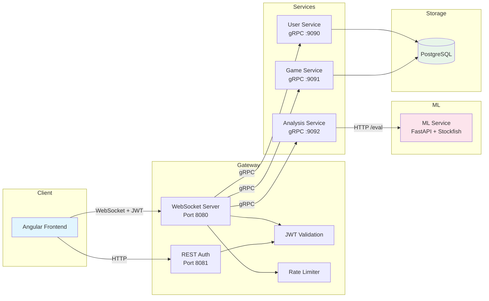

# Anti-Cheat — Chess Fraud Detection System

> Online chess cheat-detection platform built with microservices, gRPC, and machine learning.

[](https://openjdk.org/)
[](https://angular.dev/)
[](https://python.org/)
[](https://fastapi.tiangolo.com/)
[](anticheat-backend/docker-compose.yml)
[](anticheat-backend/anticheat-backend-infra/k8s/)
[](anticheat-backend/.github/workflows/ci.yml)

---

## Table of Contents

- [Description](#description)
- [Architecture](#architecture)
- [Tech Stack](#tech-stack)
- [Stack Rationale](#stack-rationale)
- [Project Structure](#project-structure)
- [Quick Start — Docker Compose](#quick-start--docker-compose)
- [Kubernetes Deployment](#kubernetes-deployment)
- [Communication Protocol](#communication-protocol)
- [Frontend (Angular 19)](#frontend-angular-19)
- [Backend (Java 21 + Python 3.11)](#backend-java-21--python-311)
- [CI/CD](#cicd)
- [Environment Variables](#environment-variables)
- [Security](#security)
- [Future Work](#future-work)

---

## Description

Online chess platforms face a growing problem: **engine-assisted cheating**. Players use chess engines (like Stockfish) during games to gain an unfair advantage.

This system builds an end-to-end **fraud detection pipeline** that:

1. **Evaluates** each move against the engine's optimal play using Stockfish (depth 12)
2. **Extracts** 23 statistical features from the evaluations (variance, kurtosis, spectral entropy, advantage reversals, etc.)
3. **Classifies** games using a trained ML model (scikit-learn RandomForest)

| Metric | Improvement over baseline |
|---------|----------------------|
| **Accuracy** | **+9.34%** |
| **Precision** | **+7.42%** |

---

## Architecture



### Data flow

| Flow | Path |
|-------|--------|
| **Login / Register** | Client → REST `POST /auth/login` → Gateway → gRPC → User Service → PostgreSQL → JWT |
| **WS connection** | Client → `ws://host:8080/ws?token=JWT` → Gateway validates JWT + rate-limit |
| **Analyze game** | WS `ANALYZE_GAME` → Gateway → gRPC → Analysis Service → HTTP `POST /eval` → ML Service (Stockfish + RandomForest) → result |
| **Save game** | WS `SAVE_GAME` → Gateway → gRPC → Game Service → INSERT into `games` + UPDATE counters in `users` |
| **View profile** | WS `USER_INFO_REQUEST` → Gateway → gRPC → User Service → SELECT `users` |
| **List games** | WS `GAMES_REQUEST` → Gateway → gRPC → Game Service → SELECT `games` |

---

## Tech Stack

| Layer | Technology | Purpose |
|------|-----------|-----------|
| **Frontend** | Angular 19, TypeScript, Chart.js, chess.js | Responsive SPA with a custom design system |
| **Gateway** | Java 21, Tyrus WebSocket, JDK HttpServer | WS + REST entry point, rate limiter |
| **Microservices** | Java 21, Maven, JDBC, BCrypt, Jackson | Business logic (user, game, analysis) |
| **ML** | Python 3.11, FastAPI, scikit-learn, python-chess, Stockfish | Fraud detection pipeline |
| **Communication** | gRPC (Protocol Buffers, HTTP/2) | RPC between services |
| **Database** | PostgreSQL 16 Alpine | User and game persistence |
| **Auth** | JWT HMAC-SHA256 (24h TTL) | Stateless authentication |
| **Infra** | Docker Compose · Kubernetes · GitHub Actions | Orchestration and CI/CD |

---

## Stack Rationale

### Why Java 21 for the microservices?

Java is the language I'm most proficient and productive in, which let me focus on architecture and business logic instead of fighting the language. Beyond familiarity, Java 21 brings concrete technical advantages for this kind of system:

- **Strong typing and a robust type system**: in a protocol with multiple message types (`ChessMessage`, `PayloadRegistry`), static typing catches serialization/deserialization errors at compile time, not at runtime.
- **Mature ecosystem for long-running services**: native JDBC, BCrypt, Jackson, Maven — no need for heavy frameworks like Spring. Services start up in ~2 seconds.
- **Native concurrency**: `ExecutorService`, `ConcurrentHashMap`, and gRPC handle multi-user concurrency well with no external dependencies.
- **Docker compatibility**: modern JVMs respect container `cgroup` limits (CPU/memory), which makes sizing on Kubernetes easier.

**Alternative considered**: Go would have offered lighter binaries and lower memory usage, but less experience with the language would have slowed development without meaningful benefit given the expected traffic volume.

### Why gRPC and not Kafka/MQTT?

gRPC fits better than a message broker for inter-service communication in this system:

- **Strongly typed contracts** — `.proto` files define the API. The compiler catches incompatible changes at compile time, instead of at runtime with malformed JSON.
- **Direct RPC semantics** — the gateway calls `UserService.Login()` like a local method. No topic routing, no correlation IDs, no response listeners. The code reflects what it does.
- **HTTP/2 multiplexing** — multiple concurrent RPCs over a single TCP connection. Lower latency and fewer resources than an intermediary broker.
- **No broker dependency** — removing Mosquitto/Kafka is one less component to deploy, monitor, and debug. Fewer pieces = fewer failure modes.
- **Code generation** — Java stubs are auto-generated from `.proto`. Adding a new RPC means: define it in the proto → regenerate → implement the method.

Kafka/MQTT make sense when you need **durable event logs**, **fan-out to multiple consumers**, or **fire-and-forget** semantics. This system doesn't need that — every request requires exactly one response, immediately. gRPC models that directly.

### Why Python + FastAPI for the ML Service?

- **ML ecosystem**: scikit-learn, python-chess, and Stockfish have mature Python bindings. Reimplementing feature extraction and model inference in Java would have required JNI wrappers or subprocesses, adding complexity with no benefit.
- **FastAPI**: typing with Pydantic, automatic OpenAPI documentation (`/docs`), and async performance with Uvicorn. Ideal for a stateless HTTP service that receives a game and returns a result.
- **Separation of concerns**: the ML Service is the only component that speaks Python. The rest of the system is Java. This clean boundary allows retraining or replacing the model without touching the microservices.

### Why Angular 19?

- **Familiarity and productivity**: Angular is the frontend framework I have the most experience with, which allowed me to iterate quickly on the UI.
- **Standalone components**: Angular 19 allows standalone components without `NgModule`, simplifying the frontend architecture.
- **Native lazy loading**: each page loads on demand, reducing the initial bundle (579 KB → 337 KB after optimization).
- **Strict TypeScript**: sharing protocol types (`protocol.ts`) between backend docs and frontend guarantees consistency in data contracts.

### Why PostgreSQL?

- **Simple relational model**: the domain has two entities with a direct relationship (`users` ↔ `games`). A document store like MongoDB would add no benefit and would lose the transactional guarantees needed for atomic counter updates.
- **ACID transactions**: when saving a game, the `games` table and the counters in `users` are updated in a single transaction. This avoids inconsistencies between stats and actual data.
- **Lightweight in Docker**: the `postgres:16-alpine` image is ~80 MB and starts in seconds.

---

## Project Structure

```
anticheat-src/
├── anticheat-backend/
│   ├── anticheat-backend-gateway/          # WebSocket + REST auth gateway
│   ├── anticheat-backend-user-service/     # User management, BCrypt, SMTP
│   ├── anticheat-backend-game-service/     # Game CRUD + counters
│   ├── anticheat-backend-analysis-service/ # ML orchestration + LRU cache
│   ├── anticheat-backend-ml-service/       # FastAPI + Stockfish + RandomForest
│   ├── anticheat-backend-libs/
│   │   ├── protocol/                       # DTOs, ChessMessage, MessageType, PayloadRegistry
│   │   └── grpc-api/                       # Protobuf definitions (.proto) and generated stubs
│   ├── anticheat-backend-infra/
│   │   ├── docker/init.sql                 # PostgreSQL schema (users + games)
│   │   └── k8s/                            # Kubernetes manifests
│   ├── docs/
│   │   ├── protocol.md                     # Full protocol reference
│   │   └── protocol.ts                     # TypeScript protocol interfaces
│   ├── .github/workflows/ci.yml            # CI pipeline (build + test)
│   ├── docker-compose.yml                  # Local orchestration (7 services)
│   ├── Makefile                            # Shortcuts: up, down, logs, test, clean
│   └── .env.example                        # Environment variable template
│
└── anticheat-frontend/
    ├── src/
    │   ├── app/
    │   │   ├── components/navbar/           # Shared responsive navbar
    │   │   ├── models/protocol.ts           # WS protocol types
    │   │   ├── services/                    # Auth, API, WebSocket, PasswordReset
    │   │   └── pages/                       # 8 pages (login, register, analysis, ...)
    │   ├── styles.css                       # Global design system (CSS custom properties)
    │   └── environments/                    # Per-environment configuration
    ├── angular.json
    └── package.json
```

---

## Quick Start — Docker Compose

### Prerequisites

- Docker ≥ 24.0 and Docker Compose ≥ 2.20
- Node.js ≥ 18 and npm ≥ 9 (frontend only)
- ~2 GB free RAM (Stockfish + PostgreSQL + 5 JVMs)

### 1. Backend

```bash
cd anticheat-backend

# 1. Copy and edit environment variables
cp .env.example .env
# REQUIRED: change JWT_SECRET, ML_SERVICE_TOKEN, DB_PASSWORD, SMTP credentials

# 2. Start all services
make up
# Equivalent to: docker compose up --build -d

# 3. Verify everything is healthy
docker compose ps
# All services should show "healthy" or "running"

# 4. View live logs
make logs
```

| Service | Port | URL | Description |
|----------|--------|-----|-------------|
| Gateway (WebSocket) | `8080` | `ws://localhost:8080/ws?token=JWT` | Authenticated WS connection |
| Gateway (REST Auth) | `8081` | `http://localhost:8081/auth/login` | Authentication endpoints |
| User Service (gRPC) | `9090` | — | User service |
| Game Service (gRPC) | `9092` | — | Game service |
| Analysis Service (gRPC) | `9094` | — | ML analysis service |
| ML Service | `5002` | `http://localhost:5002/docs` | Interactive OpenAPI documentation |
| PostgreSQL | `5432` | `postgresql://localhost:5432/anticheat` | Database |

### 2. Frontend

```bash
cd anticheat-frontend
npm install
ng serve                      # → http://localhost:4200
```

> **Note**: the frontend expects REST at `localhost:8081` and WS at `localhost:8080`. Configurable in `src/environments/environment.ts`.

### Available Make commands

| Command | Description |
|---------|-------------|
| `make up` | Builds and starts all services in the background |
| `make down` | Stops all services |
| `make logs` | Follows the logs of all services |
| `make build` | Only builds the images (without starting them) |
| `make build-libs` | Compiles the shared Java libraries |
| `make test` | Runs Java tests (protocol, services) + Python tests (ml-service) |
| `make clean` | Stops services, removes volumes and orphaned containers |

---

## Kubernetes Deployment

The project includes **10 Kubernetes manifests** ready to deploy on a local cluster (Minikube, Kind) or in the cloud.

### Manifests (`anticheat-backend-infra/k8s/`)

| File | Resource | Description |
|---------|---------|-------------|
| `00-namespace.yaml` | Namespace `anticheat` | Logical isolation of all resources |
| `01-configmap.yaml` | ConfigMap | `app-config` (URLs, paths), `postgres-init-config` (init.sql) |
| `02-secret.yaml` | Secret `anticheat-secret` | Credentials (DB, JWT, SMTP, ML token) — **change before applying** |
| `03-mosquitto.yaml` | — | _(Removed — gRPC replaces the broker)_ |
| `04-postgres.yaml` | PVC (1Gi) + StatefulSet + Headless Service | PostgreSQL 16 with persistence, `pg_isready` probes, `250m/256Mi` → `500m/512Mi` |
| `05-ml-service.yaml` | Deployment + ClusterIP Service | ML Service (FastAPI + Stockfish), HTTP `/health` probes, `500m/512Mi` → `1000m/1Gi` |
| `06-gateway.yaml` | Deployment + **NodePort** Service (30080) | Gateway WS+REST, HTTP `/health:8081` probes |
| `07-user-service.yaml` | Deployment + ClusterIP Service | gRPC server :9090, initContainers wait for PostgreSQL |
| `08-game-service.yaml` | Deployment + ClusterIP Service | gRPC server :9091, initContainers wait for PostgreSQL |
| `09-analysis-service.yaml` | Deployment + ClusterIP Service | gRPC server :9092, initContainers wait for ML Service |

### K8s deployment features

- **initContainers** with `busybox:1.36` for startup dependency management (equivalent to Docker Compose's `depends_on`)
- **Readiness + Liveness probes** on all services (HTTP `/health` or TCP socket)
- **Resource requests/limits** defined for every pod
- **StatefulSet** for PostgreSQL with a persistent 1Gi PVC
- **Headless Service** for PostgreSQL (stable DNS: `postgres-0.postgres.anticheat.svc`)
- **NodePort 30080** to expose the gateway outside the cluster
- **Secrets** separated from ConfigMaps (credentials vs. configuration)

### Step-by-step deployment (Minikube)

```bash
# 1. Start Minikube
minikube start --memory=4096 --cpus=4

# 2. Use Minikube's Docker daemon (so images are available)
eval $(minikube docker-env)

# 3. Build the images locally
cd anticheat-backend
docker build -t anticheat/gateway:latest -f anticheat-backend-gateway/Dockerfile .
docker build -t anticheat/user-service:latest -f anticheat-backend-user-service/Dockerfile .
docker build -t anticheat/game-service:latest -f anticheat-backend-game-service/Dockerfile .
docker build -t anticheat/analysis-service:latest -f anticheat-backend-analysis-service/Dockerfile .
docker build -t anticheat/ml-service:latest anticheat-backend-ml-service/

# 4. Edit the secrets in 02-secret.yaml (change all the CHANGE_ME values)

# 5. Apply the manifests in order
kubectl apply -f anticheat-backend-infra/k8s/

# 6. Verify the deployment
kubectl -n anticheat get pods -w
# Wait until all pods are Running and Ready

# 7. Access the gateway
minikube service gateway -n anticheat --url
# Or directly: http://<minikube-ip>:30080
```

---

## Communication Protocol

### Authentication (REST — Port 8081)

| Endpoint | Method | Body | Response |
|----------|--------|------|-----------|
| `/auth/login` | POST | `{"user":"x","password":"y"}` | `{"success":true,"message":"OK","token":"eyJ..."}` |
| `/auth/register` | POST | `{"user":"x","email":"e","password":"y"}` | `{"success":true,"message":"OK","token":"eyJ..."}` |
| `/auth/forgot-password` | POST | `{"email":"x"}` | `{"success":true,"message":"..."}` |
| `/auth/reset-password` | POST | `{"email":"x","password":"y"}` | `{"success":true,"message":"..."}` |
| `/health` | GET | — | Gateway health check |

### WebSocket (Port 8080)

Connection: `ws://host:8080/ws?token=JWT_TOKEN`

All messages use the `ChessMessage` envelope:
```json
{
  "type": "MESSAGE_TYPE",
  "messageId": "uuid",
  "payload": { ... }
}
```

#### Client → Server

| Type | Payload | Description |
|------|---------|-------------|
| `USER_INFO_REQUEST` | _(none)_ | Request the user's profile |
| `GAMES_REQUEST` | _(none)_ | Request the list of games |
| `ANALYZE_GAME` | `{ moves: string }` | Analyze a game (PGN moves) |
| `SAVE_GAME` | `{ moves: string, legal: boolean }` | Save an analyzed game |
| `CHANGE_PASSWORD` | `{ password: string }` | Change password (authenticated) |

#### Server → Client

| Type | Payload | Description |
|------|---------|-------------|
| `USER_INFO` | `{ email, totalGames, cheatGames, legalGames }` | Profile data |
| `GAMES` | `{ games: [{ moves, legal }] }` | List of saved games |
| `ANALYZE_RESULT` | `{ legal, white: number[], black: number[] }` | ML analysis result + per-move Stockfish evaluations |
| `SAVE_GAME_RESPONSE` | `{ success, message }` | Save confirmation |
| `CHANGE_PASSWORD_RESPONSE` | `{ success, message }` | Password change confirmation |
| `ERROR` | `{ code, message }` | Structured error |

#### Error codes

| Code | Description |
|--------|-------------|
| `MISSING_TYPE` | Missing `type` field in the JSON |
| `UNKNOWN_TYPE` | Unrecognized `MessageType` |
| `MISSING_PAYLOAD` | The type requires a payload but none was provided |
| `INVALID_PAYLOAD` | Payload failed validation or deserialization |
| `MALFORMED_JSON` | Could not be parsed as JSON |
| `RATE_LIMIT_EXCEEDED` | Exceeded 10 messages/second |
| `UNAUTHORIZED_TYPE` | Message type not allowed via WebSocket |

> 📄 Full reference with examples: [`docs/protocol.md`](anticheat-backend/docs/protocol.md)

---

## Frontend (Angular 19)

### Design System

The frontend implements its own design system based on CSS custom properties:

- **Font**: Inter (Google Fonts)
- **Palette**: primary teal (`#0D9488`), white surface, `#F1F5F9` background
- **Reusable components**: `.card`, `.btn`, `.btn-outline`, `.floating-field` (input with animated label), `.spinner`, `.error-msg`
- **Shared navbar**: responsive component with a hamburger menu on mobile
- **Responsive**: breakpoints on every page, adaptable layout

### Pages

| Route | Component | Requires Auth | Description |
|------|-----------|:---:|-------------|
| `/` | HomeComponent | ❌ | **Login** — floating labels, link to register and reset |
| `/register` | RegisterComponent | ❌ | **Registration** — inline validation |
| `/password/reset` | ResetPasswordComponent | ❌ | Request a reset code by email |
| `/password/reset/changePassword` | ConfirmResetPasswordComponent | 🔒 Guard | Confirm new password with code |
| `/password/changePassword` | ResetPasswordLoggedComponent | 🔒 Auth | Change password while logged in |
| `/home` | PrincipalComponent | 🔒 Auth | **Analysis** — paste/upload PGN, Chart.js graph, ML result |
| `/profile` | ProfileComponent | 🔒 Auth | **Profile** — stats (total, legal, cheated), password change |
| `/games` | GamesComponent | 🔒 Auth | **History** — list of games with legal/cheat badge |

### Services

| Service | Responsibility |
|----------|----------------|
| `ApiService` | REST HTTP calls to the gateway (login, register, forgot/reset password) |
| `AuthService` | Session management (JWT + username in `localStorage`) |
| `WebsocketService` | Persistent WS connection with automatic reconnection (exponential backoff) |
| `PasswordResetDataService` | State of the password reset flow across routes |

---

## Backend (Java 21 + Python 3.11)

### Gateway

| Feature | Detail |
|---------|---------|
| REST Auth | Port `8081` — login, register, forgot-password, reset-password, health |
| WebSocket | Port `8080` — endpoint `/ws?token=JWT`, `ChessMessage` protocol |
| JWT | HMAC-SHA256, 24h TTL, username as subject |
| Rate limiter | 10 msg/s per user, disconnects when exceeded |
| Origin check | Configurable allowlist via `ALLOWED_ORIGINS` |
| gRPC client | Translates WS messages → gRPC calls to backend services |

### User Service (gRPC :9090)

- **Authentication**: BCrypt cost factor 12
- **Profile management**: email, game statistics
- **SMTP**: sends password reset emails (Gmail compatible)
- **Communication**: gRPC server + PostgreSQL

### Game Service (gRPC :9091)

- **Game CRUD**: INSERT + SELECT on the `games` table
- **Stats update**: on save, updates `total_games`, `cheated_games`, `fair_games` in `users` (transactional)
- **Communication**: gRPC server + PostgreSQL

### Analysis Service (gRPC :9092)

- **Orchestration**: receives a game via gRPC, invokes the ML Service via HTTP
- **LRU cache**: avoids re-analyzing games that have already been processed
- **Communication**: gRPC server + HTTP to ML Service

### ML Service (Python FastAPI)

| Feature | Detail |
|---------|---------|
| Framework | FastAPI + Uvicorn, port `5002` |
| Chess engine | Pool of Stockfish workers (configurable, default 10, depth 12) |
| Extracted features | 23 statistical features per game |
| Model | RandomForest (scikit-learn), `.joblib` file |
| Auth | Bearer token (`AUTH_TOKEN`) |
| Endpoints | `GET /health`, `POST /eval`, `POST /predict` |
| Documentation | Interactive OpenAPI at `/docs` |

### Database (PostgreSQL 16)

```sql
CREATE TABLE users (
    name          VARCHAR(255) PRIMARY KEY,
    email         VARCHAR(255) UNIQUE NOT NULL,
    password      VARCHAR(255) NOT NULL,     -- BCrypt hash
    total_games   INT DEFAULT 0,
    cheated_games INT DEFAULT 0,
    fair_games    INT DEFAULT 0
);

CREATE TABLE games (
    id       SERIAL PRIMARY KEY,
    username VARCHAR(255) NOT NULL,
    moves    TEXT         NOT NULL,           -- Algebraic notation
    legal    BOOLEAN      NOT NULL            -- true=legal, false=cheat
);
```

---

## CI/CD

### GitHub Actions (`ci.yml`)

The pipeline runs on push/PR to `main` and consists of 7 parallel jobs:

```
build-libs ─┬─► build-gateway
             ├─► build-user-service
             ├─► build-game-service
             ├─► build-analysis-service
             └─► test-shared (protocol tests)

test-ml-service (independent, Python 3.11 + pytest)
```

| Job | What it does |
|-----|----------|
| `build-libs` | Compiles `anticheat-backend-libs` (protocol, grpc-api) with Maven |
| `build-gateway` | Compiles the gateway (`mvn package`) |
| `build-user-service` | Compiles user-service |
| `build-game-service` | Compiles game-service |
| `build-analysis-service` | Compiles analysis-service |
| `test-shared` | Runs protocol unit tests |
| `test-ml-service` | Installs Python dependencies and runs `pytest` |

> The Java builds use Maven caching (`actions/cache@v4`) to share compiled libs between jobs.

---

## Environment Variables

Copy `.env.example` to `.env` and configure:

| Variable | Required | Service | Description |
|----------|:---------:|----------|-------------|
| `JWT_SECRET` | ✅ | Gateway | Key used to sign JWTs (generate with `openssl rand -hex 32`) |
| `DB_PASSWORD` | ✅ | PostgreSQL, User/Game Svc | PostgreSQL password |
| `ML_SERVICE_TOKEN` | ✅ | Analysis Service | Token shared with the ML Service |
| `AUTH_TOKEN` | ✅ | ML Service | Bearer token to authenticate HTTP requests |
| `SMTP_USER` | ✅ | User Service | Email address used for SMTP sending (e.g. Gmail) |
| `SMTP_PASSWORD` | ✅ | User Service | SMTP application password |
| `DB_HOST` | ⚙️ | User/Game Svc | PostgreSQL host (default: `postgres`) |
| `DB_USER` | ⚙️ | User/Game Svc | PostgreSQL user (default: `postgres`) |
| `ALLOWED_ORIGINS` | ⚙️ | Gateway | Allowed origins for WS (default: `http://localhost:4200`) |
| `STOCKFISH_WORKERS` | ⚙️ | ML Service | Concurrent Stockfish workers (default: `10`) |
| `CHESS_INSIGHTS_URL` | ⚙️ | Analysis Service | ML Service URL (default: `http://ml-service:5002/eval`) |

✅ = Must be changed · ⚙️ = Has a working default value

---

## License

MIT
