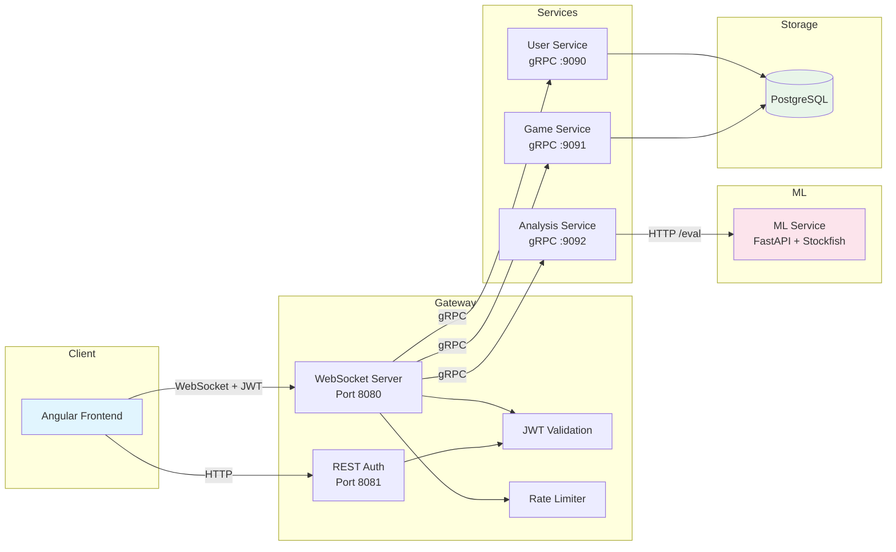

#  Chess Fraud Detection System

> Real-time chess cheating detection using microservices, gRPC inter-service communication, and machine learning.

[](https://openjdk.org/)
[](https://python.org/)
[](https://fastapi.tiangolo.com/)
[](LICENSE)
[](docker-compose.yml)

---

## The Problem

Online chess platforms face a growing challenge: **engine-assisted cheating**. Players use chess engines (like Stockfish) during games to gain an unfair advantage, undermining fair competition.

Traditional detection relies on post-game statistical analysis, which is slow and misses subtle cheating patterns. This project builds a **real-time fraud detection pipeline** that:

1. Evaluates every move against engine-optimal play using Stockfish
2. Extracts 23 statistical features from game evaluations (variance, kurtosis, spectral entropy, advantage inversions, etc.)
3. Classifies games using a trained ML model (scikit-learn)

### Key Results

| Metric | Improvement |
|--------|------------|
| **Accuracy** | **+9.34%** over baseline |
| **Precision** | **+7.42%** over baseline |

---

## Architecture



### Data Flow

1. **Client** connects via WebSocket with JWT token → Gateway validates and rate-limits
2. **Gateway** deserializes typed `ChessMessage` envelope → calls the appropriate backend service via gRPC
3. **Game/User Service** processes request → persists to PostgreSQL → returns gRPC response
4. **Analysis Service** receives game → calls ML Service HTTP API → returns fraud classification
5. **ML Service** runs Stockfish evaluation → extracts 23 features → predicts with trained model

---

## Quick Start

```bash
# Clone and start everything
git clone <repo-url> && cd chessFraud
make up
```

That's it. All services start via Docker Compose.

| Service | Port | URL |
|---------|------|-----|
| Gateway (WebSocket) | 8080 | `ws://localhost:8080/ws?token=JWT` |
| Gateway (REST Auth) | 8081 | `http://localhost:8081/auth/login` |
| User Service (gRPC) | 9090 | — |
| Game Service (gRPC) | 9092 | — |
| Analysis Service (gRPC) | 9094 | — |
| ML Service Docs | 5002 | `http://localhost:5002/docs` |
| PostgreSQL | 5432 | `postgresql://localhost:5432/anticheat` |

### Make Targets

```bash
make up      # Build and start all services
make down    # Stop all services
make logs    # Follow service logs
make test    # Run all tests (Java + Python)
make clean   # Remove containers and volumes
```

---

## Project Structure

```
anticheat-backend/
├── anticheat-backend-gateway/          # WebSocket entry point, JWT auth, rate limiting, gRPC client
├── anticheat-backend-game-service/     # Game CRUD and persistence (gRPC server)
├── anticheat-backend-analysis-service/ # ML orchestration (gRPC server, calls ml-service)
├── anticheat-backend-user-service/     # User auth and profile management (gRPC server)
├── anticheat-backend-ml-service/       # FastAPI + Stockfish + sklearn model
├── anticheat-backend-libs/
│   ├── grpc-api/         # Protobuf definitions (.proto) and generated stubs
│   ├── ws-lib/           # WebSocket server library (Tyrus)
│   └── protocol/         # DTOs, protocol definitions, DB utility
├── anticheat-backend-infra/
│   ├── docker/           # Database init scripts
│   └── k8s/              # Kubernetes manifests
├── docs/
│   ├── protocol.md       # Full WebSocket protocol reference
│   └── protocol.ts       # TypeScript interfaces for frontend
├── docker-compose.yml
├── Makefile
└── .env.example
```

Each service has its own `README.md` with inputs, outputs, and standalone run instructions.

---

## Architecture Decisions

### Why plain Java over Spring?

This project demonstrates **core Java engineering** — no framework magic. Every WebSocket server, HTTP endpoint, MQTT client, and connection pool is built from explicit code. The result is a lightweight system where every line is intentional and traceable, which matters for a portfolio project.

### Why gRPC over Kafka/MQTT?

gRPC is the right fit for **synchronous request-response** between microservices in this system:

- **Strongly typed contracts** — `.proto` files define the API. The compiler catches breaking changes at build time, not at runtime with a malformed JSON payload
- **Direct RPC semantics** — the gateway calls `UserService.Login()` like a local method. No topic routing, no message correlation IDs, no response listeners. The code reads like what it does
- **HTTP/2 multiplexing** — multiple concurrent RPCs over a single TCP connection. Lower latency and fewer resources than one-connection-per-request or broker-mediated messaging
- **No broker dependency** — removing the message broker (Mosquitto/Kafka) eliminates an infrastructure component to deploy, monitor, and debug. Fewer moving parts = fewer failure modes
- **Code generation** — Java and Python stubs are auto-generated from `.proto` files. Adding a new RPC is: define it in proto → regenerate → implement the method

Kafka/MQTT make sense when you need **durable event logs**, **fan-out to multiple consumers**, or **fire-and-forget** semantics. This system doesn't — every request needs exactly one response, immediately. gRPC models that directly.

### Why FastAPI over Flask?

- **Auto-generated OpenAPI docs** at `/docs` — zero extra work
- **Pydantic validation** — request/response schemas are enforced, not hoped for
- **Async support** — ready for concurrent Stockfish evaluations
- **Type hints** — the codebase is self-documenting

### Why this ML approach?

The system extracts **23 statistical features** from Stockfish evaluations (mean, variance, kurtosis, spectral entropy, advantage inversions, phase-specific means, etc.) and feeds them to a trained scikit-learn classifier. This approach was chosen because:

- Features are **interpretable** — you can explain *why* a game was flagged
- Stockfish provides **ground truth** for move quality
- The feature set captures both **consistency patterns** (cheaters play unnaturally consistently) and **phase behavior** (cheaters may only cheat in critical positions)

---

## Tech Stack

| Layer | Technology | Purpose |
|-------|-----------|---------|
| Gateway | Java 21, Tomcat WebSocket, JDK HttpServer | WebSocket/REST entry point |
| Services | Java 21, Maven, gRPC | Business logic |
| ML | Python 3.11, FastAPI, scikit-learn, Stockfish | Fraud classification |
| Communication | gRPC (Protocol Buffers) | Inter-service RPC |
| Database | PostgreSQL 16 | Persistence |
| Protocol | Jackson, Pydantic | Typed JSON serialization |
| Auth | JWT (HMAC-SHA256) | Stateless authentication |
| Infra | Docker Compose, Kubernetes | Orchestration |

---

## Testing

```bash
# Java tests (protocol serialization, payload validation)
cd shared && mvn test

# Python tests (ML feature extraction)
cd ml-service && pytest
```

Tests focus on **critical paths**: protocol correctness and ML feature extraction accuracy.

---

## Protocol

The system uses a typed JSON envelope for all WebSocket messages:

```json
{
  "type": "ANALYZE_GAME",
  "messageId": "uuid",
  "payload": { "moves": "e2e4 e7e5 g1f3 b8c6" }
}
```

21 message types, fully documented in [`docs/protocol.md`](docs/protocol.md). TypeScript interfaces in [`docs/protocol.ts`](docs/protocol.ts).

---

## Environment Variables

See [`.env.example`](.env.example) for all required configuration. Key variables:

| Variable | Description | Default |
|----------|-------------|---------|
| `JWT_SECRET` | HMAC key for JWT signing | Dev fallback (warning logged) |
| `DB_HOST` | PostgreSQL hostname | `postgres` |
| `AUTH_TOKEN` | ML service bearer token | — |
| `STOCKFISH_PATH` | Path to Stockfish binary | `/usr/games/stockfish` |

---

## License

MIT
